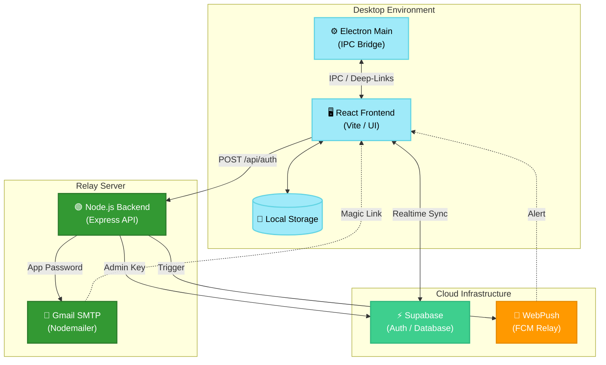

# DayFlow — Daily To-Do Tracker

> **Deep Space Neon** • React • Electron • Supabase • Node.js • Leva AI

A professional, standalone desktop productivity tracker with an AI companion named **Leva**. DayFlow syncs your tasks across devices using Supabase and handles automated reporting/notifications via a custom Node.js relay.

---

## 🏗️ Architecture & Data Flow

DayFlow uses a modern "Bridge" architecture to keep your desktop app lightweight while offloading sensitive operations (like emails and push notifications) to a secure backend.



### Flow Highlights:
1.  **Authentication**: The frontend requests a magic link from the Backend. The Backend uses the Supabase Admin API to generate a link and sends it via Gmail SMTP.
2.  **Deep-Linking**: When you click the link in your email, the OS opens `dayflow://`. Electron catches this, forwards it to React via IPC, and logs you in.
3.  **Cloud Sync**: Once logged in, your tasks are stored in Supabase with Realtime synchronization enabled. If offline, the app falls back to a local encrypted cache.

---

## 🚀 Getting Started

### 1. Prerequisites
- **Node.js** (v18+)
- **Supabase Account** (URL, Anon Key, Service Role Key)
- **Gmail Account** (for SMTP sending via App Password)

### 2. Environment Setup
Create a `.env` file in the root directory:
```env
# Supabase
VITE_SUPABASE_URL=your_url
VITE_SUPABASE_ANON_KEY=your_anon_key
SUPABASE_SERVICE_ROLE_KEY=your_service_role_key

# Email (Gmail SMTP)
EMAIL_USER=your_email@gmail.com
EMAIL_PASS=your_gmail_app_password

# AI & Other
GEMINI_API_KEY=your_api_key
VAPID_PUBLIC_KEY=...
VAPID_PRIVATE_KEY=...
```

### 3. Installation
```bash
# Install frontend & desktop dependencies
npm install

# Install backend dependencies
cd server
npm install
```

### 4. Running the App
Open two terminals:

**Terminal 1 (Backend):**
```bash
cd server
node index.js
```

**Terminal 2 (Frontend/Desktop):**
```bash
npm run dev
```

---

## 📦 Building for Production

To create a downloadable `.exe` installer for Windows:
```bash
npm run build
```
The installer will be generated in the `/release` folder.

---

## 🛠️ Module Map

| File | Responsibility |
|------|---------------|
| `main.js` | Electron Main process: deep-linking, window management. |
| `preload.cjs` | Secure bridge between Electron and React (IPC). |
| `server/index.js` | Node.js Relay: Gmail SMTP, Cron reports, Push notifications. |
| `src/hooks/useAuth.js` | Supabase Auth logic + Deep-link handling. |
| `src/hooks/useTasks.js` | Realtime task synchronization + CRUD. |
| `src/utils/storage.js` | Electron-store / LocalStorage abstraction. |
| `src/views/` | Page compositions (Today, Weekly, Settings). |

---

## 🎨 Tech Stack
- **Frontend**: React 18, Vite, Recharts (Stats)
- **Desktop**: Electron, Electron-Builder (Packaging)
- **Database**: Supabase (Postgres + Realtime)
- **Communication**: Nodemailer (Gmail SMTP), WebPush API
- **Design**: Space Grotesk Font, Glassmorphism CSS
